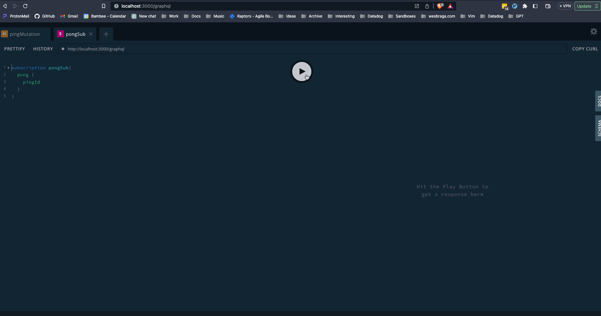

# NestJS GraphQL Subscriptions Example

In this example we are utilizing Graphql Subscription with Redis PubSub to send a ping mutation and reply with a pong subscription

See below



## Getting Started Locally

1. `yarn install`
2. `yarn local:init`
3. `yarn start:dev`
4. Navigate to http://localhost:3000/graphql

5. Add the following subscription in one tab

```graphql
subscription pongSubscription {
    pong {
        pingId
    }
}
```
6. Hit play
7. Create another tab and add the following mutation

```graphql
mutation pingMutation {
    ping {
        id
    }
}
```
8. Hit play and notice in the pongSubscription tab that you have a result
